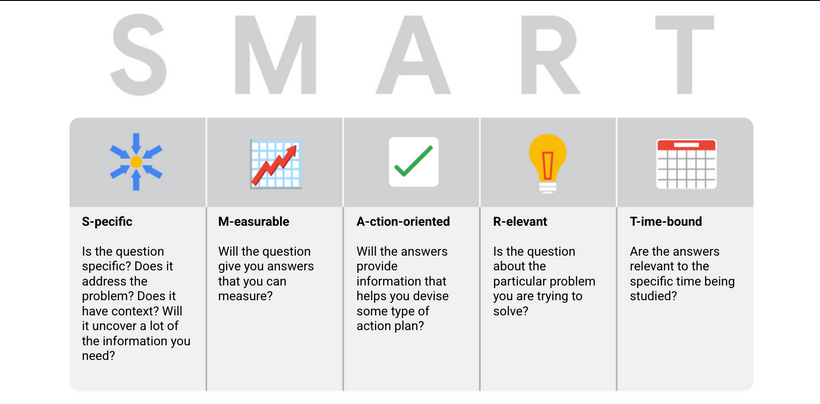

## SMART questions

SMART:

* Specifc: one thing at a time
* Measrueable: should be measureed in scale
* Action-oriented: Should help to take some action
* Time-bound: should have a time line

> Image credit: [Google Data Analytics Specialization ](https://www.coursera.org/specializations/data-analytics-certificate)

Things to avoid:

* Leading question: answer is part of question
* Closed-ended questions: short response or Y/N type
* Vague questions: not specific
