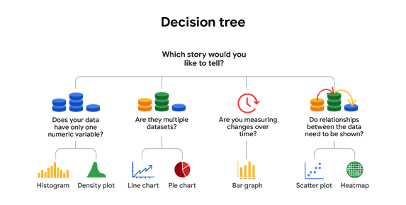
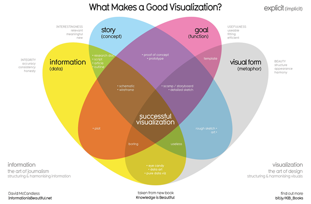
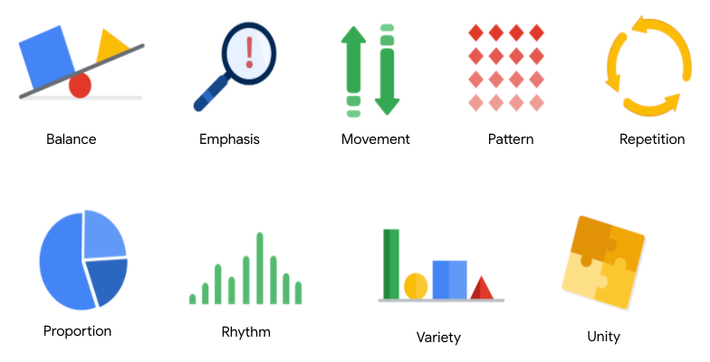
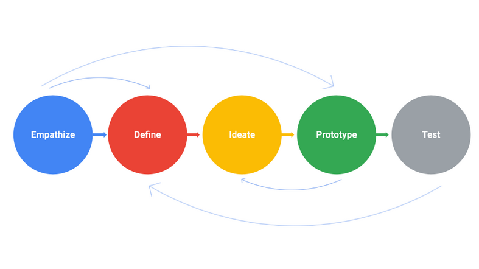

## **Basics of visualization**

#### Decision Tree

A **decision tree** is a flowchart that you can use to help frame larger decisions as a series of smaller yes/no decisions.

#### Elements of successful data visualization

* Information: reflects the conclusion you’ve drawn from the data, which you will communicate with visualization
* Story: adds meaning to the data and makes it interesting
* Goals: makes the data usable and useful
* Visual form: creates both beauty and structure

#### Nine Basic principles of design

#### colors

* hue: actual colors
* Intensity: bright/dull
* value: light/dark

#### Design thinking process

* **Empathize**: Think about the emotions and needs of the target audience.
* **Define**: Understand the audience’s needs, problems, and insights.
* **Ideate**: Use your findings from the previous phases to begin to create data visualizations.
* **Prototype:** Start putting it all together. In this case, you can put your findings into  a presentation or dashboard.
* **Test**: Check that your prototype is effective. In this case, you can show your visualizations to team members before the presentation.

#### [How to choose a data visualization](https://d3c33hcgiwev3.cloudfront.net/XsaUfemhQ-qGlH3poXPqMg_4b74b6280a7a4a10a83e6b5ca9138630_How-to-choose-a-data-visualization.pdf?Expires=1704585600&Signature=SgVG~PNY9O3dr5t3H2d-3wy08jxEmCfr8FF~U9kgXZx6LxLzBJjMdCncvYujL1jWuYtfysDD4PUvF2bDM77nwrzWHSoamRDqTO2EgKhY-XOmuO4aY4RQS7kQ8LlAgKC4orxXnsmM0HmM0HKgUxGrv2xpiBj0-LmKJs45ejA0EgQ_&Key-Pair-Id=APKAJLTNE6QMUY6HBC5A) (click on it)
