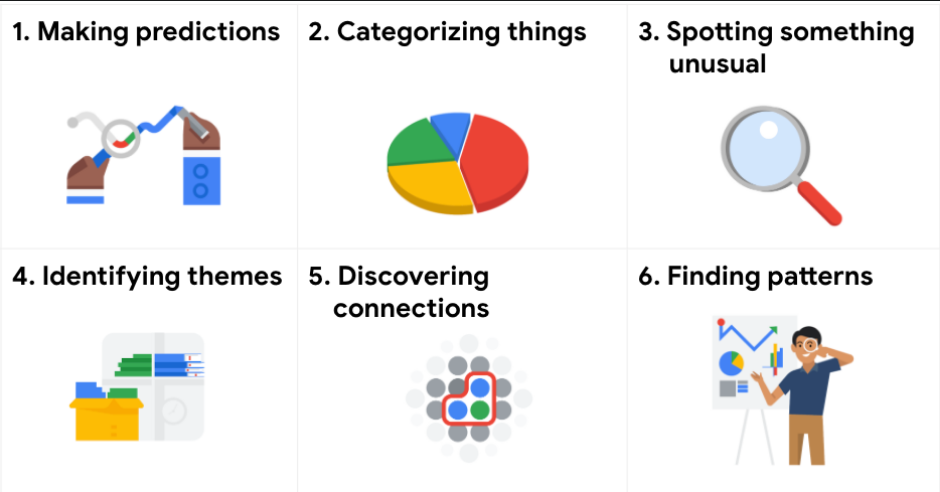

## Common problem types

1. Making Predictions: based on prev data
2. Categorizing things: classify to corelate
3. spotting something unusual: find things that are not normal
4. Identifyin themes: find broad concept and trends by grouping categorized data
5. Discovering connections: connecting the dots by identifying same challenges across different problems nto find common solution
6. Finding pattens: trends analysis

> Image credit: [Google Data Analytics Specialization ](https://www.coursera.org/specializations/data-analytics-certificate)
