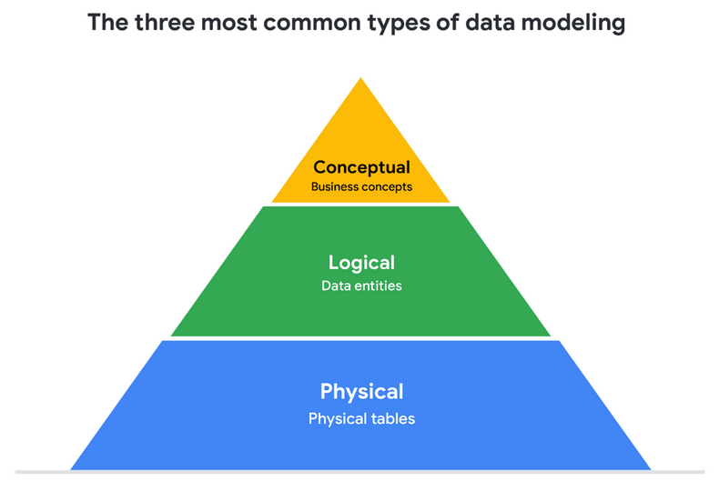

## Data Modeling

Data modelling is process of visually represting how data is organized and structure.

Commmon levels of Data modelling are:

* Conceptual Level:only viusal represtation of data as per need.
* Logical Level:Technical details like rel,attri lies here
* Physical Level:shows db operations

> Image credit: [Google Data Analytics Specialization ](https://www.coursera.org/specializations/data-analytics-certificate)

Data-modeling techniques: 

1) Entity Relationship Diagram (ERD)
2) Unified Modeling Language (UML) diagram
